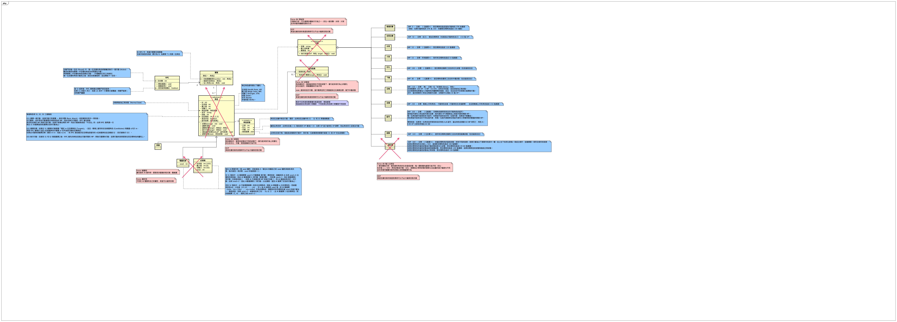
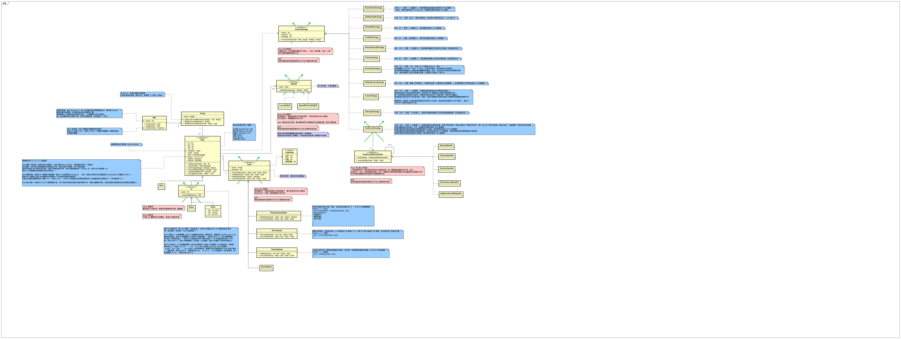
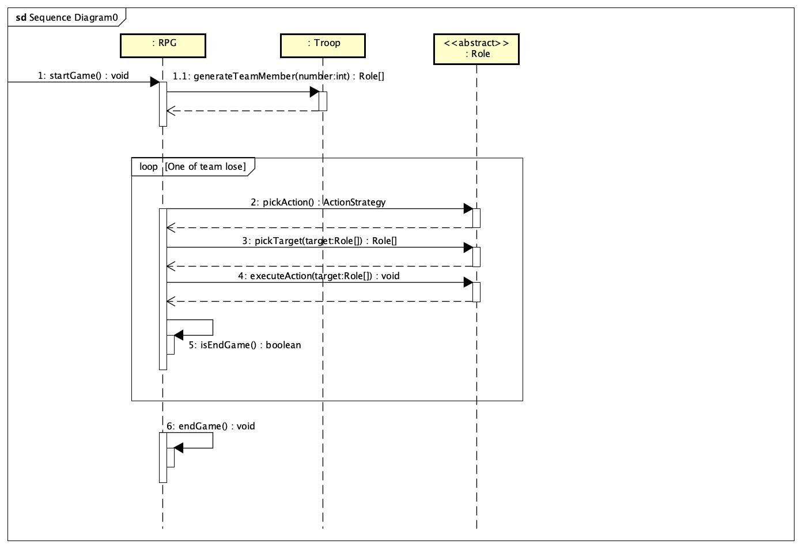
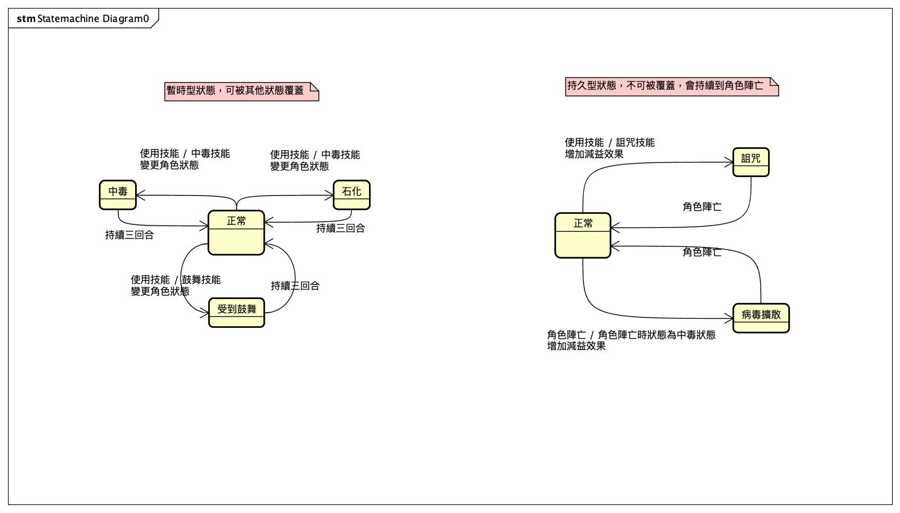

# WaterBall-WhiteGym-FinalWar

[水球軟體學院](https://waterballsa.tw/design-pattern/)-軟體設計模式精通之旅白段道館的最終章的題目

以 OOP 為基礎的 RPG 對戰遊戲專案

## 專案結構
- `index.ts`：主程式入口
- `class/`：遊戲核心類別與策略
- `enum/`、`interface/`、`roleState/`：遊戲狀態與介面定義

## 安裝與執行
1. 安裝依賴：
   ```sh
   npm install
   ```
2. 執行主程式：
   ```sh
   npm run dev
   ```

## UML

以下是練習 OOAD 所繪製的 diagram

### OOA

### OOD

### Sequence Diagram

### State Machine

